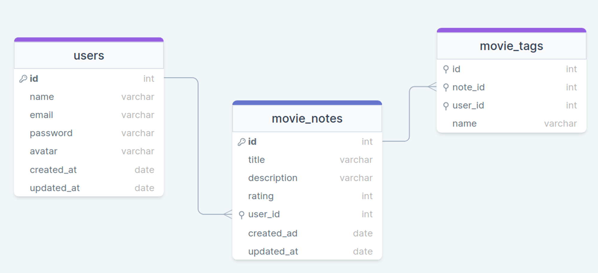

## 💻 Projeto

###### Registro de informações sobre filmes
Aplicação em Node.js desenvolvida para o usuário cadastrar seus filmes favoritos colocando (nome, descrição, notas e tags relacionadas a ele).

Nesse projeto foram incluídos:
- Criptografia de senhas;
- Validação de e-mail;
- Aplicação do cascade para garantir que uma tag será excluída caso o usuário opte por excluir a nota.

## ✨ Tecnologias

- [Nodemon](https://www.npmjs.com/package/nodemon)
- [Express](https://expressjs.com/pt-br/)
- [Knex](https://knexjs.org/guide/schema-builder.html)
- [SQLite](/#)
- [SGBD - Beekeeper](https://www.beekeeperstudio.io/)
- [Hash - criptografia de senhas](/#)
- [Middleware - intermediação DB](/#)
- E muitas outras…

## 🚀 Como executar

Ao acessar a pasta, é preciso baixar os pacotes com o gerenciador de pacotes npm.
Você pode executar o seguinte comando:
- npm install

Em seguida para rodar a aplicação, basta executar o comando abaixo:
- npm run dev

Você pode usar o Insominia para testar toda a aplicação, que permite:
- Cadastrar um usuário colocando (nome, email, senha, avatar)
- Atualizar os dados de usuário
- Cadastrar seus filmes favoritos (Título do filme, descrição, nota atribuida ao filme)
- Cadastrar tags (Nome da tag)

## 🔖 Layout

Você pode visualizar a estrutura do projeto na imagem abaixo:

  Feito com 💜 por Jessica Andreoli

